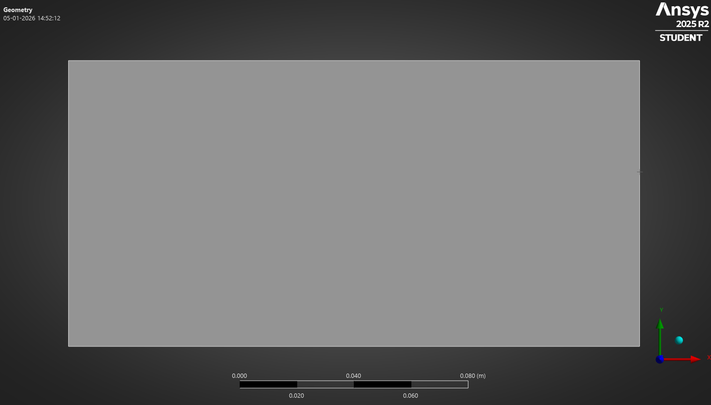
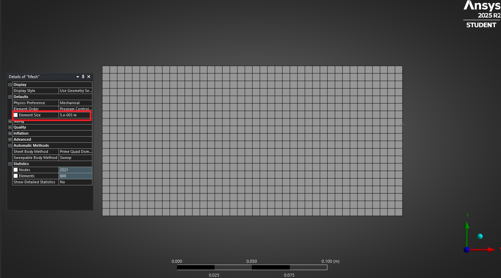
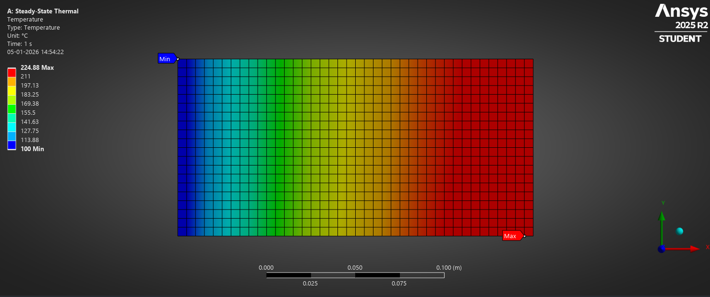
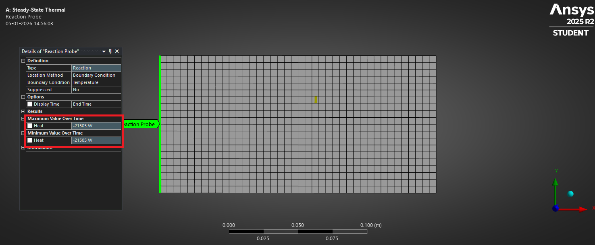
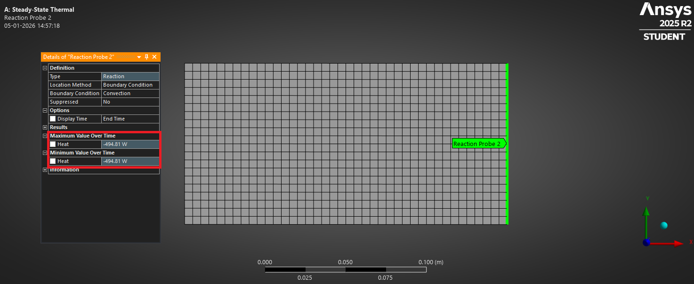
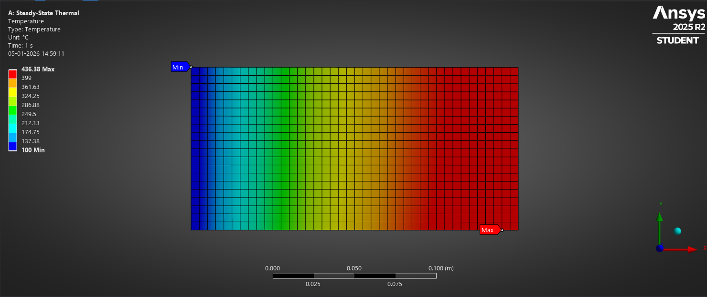

# 2D Steady-State Thermal Analysis using ANSYS

Finite Element analysis of steady-state 2D heat conduction with internal heat generation and mixed boundary conditions.

---

## 1. Project Overview

This project investigates steady-state heat conduction in a two-dimensional plate using Finite Element Analysis (FEA). The model includes internal heat generation and mixed thermal boundary conditions to represent realistic heat transfer scenarios. The objective is to evaluate the temperature distribution, identify hotspot locations, and study how material properties and boundary conditions influence the maximum temperature. The analysis is performed in ANSYS Mechanical and validated using mesh independence and global energy balance checks.

## 2. Problem Definition

A rectangular 2D plate is subjected to internal volumetric heat generation and an imposed heat flux at the bottom boundary. Heat is removed through a fixed-temperature boundary on the left edge and convective heat transfer on the right edge, while the top boundary is insulated. The system is analyzed under steady-state conditions to determine the temperature field and peak temperature within the plate.

## 3. Geometry and Assumptions

- Plate dimensions: 200 mm × 100 mm  
- Analysis performed as a 2D planar model with unit thickness  
- Steady-state thermal conditions (no time dependence)  
- Material properties assumed constant  
- Radiation effects neglected  
- Heat transfer occurs only through specified boundaries

## 6. Numerical Method and Solver Details

The problem is solved using the steady-state thermal solver in ANSYS Mechanical. The geometry is discretized using 2D thermal finite elements, and temperature is solved at the nodal locations. A mesh convergence study was performed to ensure that the solution is independent of mesh size. The final mesh was selected based on stable peak temperature values with further refinement resulting in negligible changes.

## 7. Results and Physical Interpretation

The steady-state temperature distribution shows a non-uniform temperature field due to internal heat generation and asymmetric boundary conditions. The maximum temperature occurs near the bottom-right region of the plate, where heat input is high and heat removal is relatively weak. The fixed-temperature boundary on the left edge acts as a strong heat sink, while the convective boundary provides limited cooling, leading to a temperature gradient across the plate.

For the baseline case using Aluminium and a convection coefficient of 25 W/m²·K, the maximum temperature is approximately 225 °C.

## 8. Verification and Validation

To verify the physical correctness of the steady-state solution, a global energy balance was performed. At steady state, the total heat entering the system must equal the total heat leaving the system.

The total heat input consists of:
- Internal volumetric heat generation: 20,000 W  
- Imposed bottom heat flux: 2,000 W  

This results in a total heat input of 22,000 W.

Reaction heat flow probes were used in ANSYS to extract the heat removal at the fixed-temperature boundary and the convective boundary. The heat removed through the left boundary was approximately 21.50 kW, while the heat removed through the convective boundary was approximately 0.49 kW. The total heat leaving the system closely matches the total heat input, confirming global energy conservation and validating the numerical solution.

## 9. Engineering Comparison Study

A parametric comparison was performed to evaluate the influence of boundary conditions and material properties on peak temperature.

First, the convection coefficient on the right boundary was increased from 25 W/m²·K to 100 W/m²·K while keeping all other parameters unchanged. This resulted in a reduction of the maximum temperature from approximately 225 °C to 210 °C, indicating that enhanced convection improves heat removal but has a limited impact compared to internal conduction.

Next, the material was changed from Aluminium to Structural Steel while keeping the baseline boundary conditions. Due to the significantly lower thermal conductivity of steel, the maximum temperature increased drastically to approximately 436 °C, and the hotspot became more localized near the right boundary. This demonstrates that material thermal conductivity plays a dominant role in controlling temperature rise in this configuration.

## 10. Key Conclusions

- Steady-state thermal FEA was successfully performed for a 2D plate with internal heat generation and mixed boundary conditions.
- The maximum temperature is governed primarily by material thermal conductivity rather than convective cooling alone.
- Increasing convection provided moderate temperature reduction, while reducing thermal conductivity caused a significant temperature rise.
- Global energy balance verification confirmed the physical correctness of the numerical solution.
- The study highlights the importance of internal heat spreading in thermal design.

## 11. Software and Tools Used

- ANSYS Workbench (Steady-State Thermal, Mechanical)
- GitHub (Project documentation and version control)

